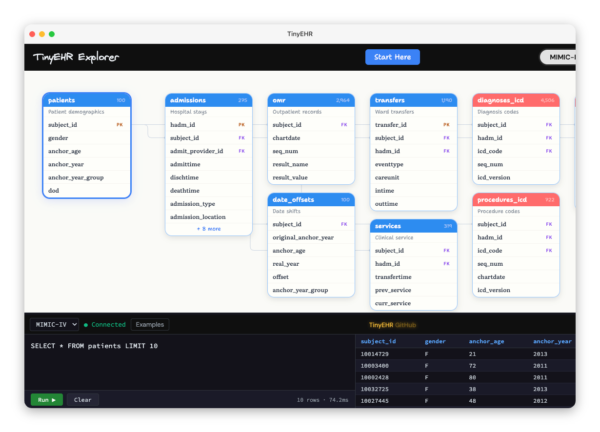

<p align="center">
  <a href="LICENSE"></a>
  <a href="https://huggingface.co/datasets/vidulpanickan/TinyEHR"></a>
  
  <a href="https://tinyehr.org"></a>
  <!-- <a href="https://doi.org/YOUR-DOI"></a> -->
</p>

A `100` patient dataset of Electronic Health Records, built for learning, experimenting, and prototyping healthcare data tools.

The structured data comes from real de-identified hospital records ([MIMIC-IV Demo](https://physionet.org/content/mimic-iv-demo/2.2/)). Dates have been shifted to realistic calendar years, and the dataset includes 4,580 synthetic clinical notes generated from each patient's diagnoses, labs, and admission data. These mirror the types of notes (discharge summaries, physician progress notes, nursing assessments, radiology reports, etc.) that clinicians write during a hospital stay.

> [!NOTE]
> **What is EHR data?**
>
> Electronic Health Records are digital records of everything that happens during a patient's visit to the hospital. It includes information about the patients themselves, what they were diagnosed with, what tests and treatments they received, and what the doctors and nurses wrote down. Hospitals use them to track patient care, keep legal records, and handle billing. Each of these becomes a separate table in the database.
>
> This dataset comes from a US hospital (Beth Israel Deaconess Medical Center in Boston). The data is real but de-identified, meaning it has been stripped of any information that could identify the patient such as names, medical record numbers, and addresses to protect patient privacy.

## How to use?

<table>
<tr>
<td align="center" width="25%"><b>Load as a DataFrame</b><br><br><code>pip install tinyehr</code> and pull tables directly into pandas</td>
<td align="center" width="25%"><b>Download from HuggingFace</b><br><br>Grab Parquet files from <a href="https://huggingface.co/datasets/vidulpanickan/TinyEHR">the dataset page</a></td>
<td align="center" width="25%"><b>Build with agents</b><br><br>Give your AI agents a real EHR dataset to query, reason over, and prototype with</td>
<td align="center" width="25%"><b>Explore in the browser</b><br><br>Run SQL queries and browse the data at <a href="https://tinyehr.org">tinyehr.org</a></td>
</tr>
</table>

<a href="https://tinyehr.org"></a>

> [!TIP]
> **New to Electronic Health Records?** Click on the image above to go to the website where you can explore tables, run queries, and learn how clinical data is structured.

## Quick Start

```bash
pip install tinyehr
```

```python
import tinyehr
```

or directly from HuggingFace:

```python
import pandas as pd

df = pd.read_parquet("hf://datasets/vidulpanickan/TinyEHR/tinyehr_mimic_format/patients.parquet")
```

### Load a table as a DataFrame

```python
patients = tinyehr.load_table("patients")
patients.head()
```

| subject_id | gender | anchor_age | anchor_year | anchor_year_group | dod |
|:-----------|:------:|-----------:|------------:|:------------------|:----|
| 10014729 | F | 21 | 2013 | 2011 – 2013 | NaT |
| 10003400 | F | 72 | 2011 | 2011 – 2013 | 2014-09-02 |
| 10002428 | F | 80 | 2011 | 2011 – 2013 | NaT |
| 10032725 | F | 38 | 2013 | 2011 – 2013 | 2013-03-30 |
| 10027445 | F | 48 | 2012 | 2011 – 2013 | 2016-02-09 |

### Pull all data for one patient

```python
patient = tinyehr.get_patient(10000032)
```

| Table | Rows |
|:------|-----:|
| admissions | 4 |
| chartevents | 477 |
| diagnoses_icd | 39 |
| labevents | 623 |
| noteevents | 32 |
| prescriptions | 81 |

<details>
<summary><b>More examples</b></summary>

### What's in the dataset?

```python
tinyehr.info()
```

| Table | Rows |
|:------|-----:|
| admissions | 275 |
| caregiver | 15,468 |
| chartevents | 668,862 |
| d_hcpcs | 89,200 |
| d_icd_diagnoses | 109,775 |
| ... | ... |

> *33 tables, 1,403,180 rows (MIMIC-IV format)*

### Build a local SQLite database

```python
db_path = tinyehr.build_sqlite()

import sqlite3
conn = sqlite3.connect(db_path)
conn.execute("SELECT * FROM admissions LIMIT 5").fetchall()
```

</details>

## Data

TinyEHR ships in two formats from the same 100 patients. Both contain the same clinical information, just organized differently.

### MIMIC-IV Format (`33` tables)

Follows the MIMIC-IV schema, a widely used format for de-identified electronic health records from Beth Israel Deaconess Medical Center. If you're learning how hospital data works, start here.

- 22 hospital tables (admissions, diagnoses, labs, medications, procedures, etc.)
- 9 ICU (Intensive Care Unit) tables (vitals, infusions, ventilator settings, etc.)
- `noteevents`: 4,580 synthetic clinical notes across 14 types (discharge summaries, physician notes, nursing assessments, radiology reports, etc.)
- `date_offsets`: records how each patient's dates were shifted, for reproducibility

Diagnosis and procedure codes include decimal points (e.g., `413.9`, `39.61`) to match how they appear in clinical practice and medical coding textbooks.

### OMOP CDM v5.3.1 Format (`23` populated tables)

A standardized research format used by the OHDSI community to run the same analysis across hospitals worldwide. If you're building tools that need to work across different health systems, use this format.

The same clinical data is reorganized into a universal schema where diagnoses, lab tests, and medications are mapped to standardized medical vocabularies. Diagnosis codes are stored *without* decimal points (e.g., `4139` instead of `413.9`) because that's how they appear in billing and insurance claims.

> [!NOTE]
> **Why does OMOP show 852 visits vs MIMIC's 275 admissions?** The OHDSI conversion process creates additional outpatient visits from lab tests and specimens that weren't tied to a hospital admission. This is standard behavior, not a data error.

### Data Types

Medical codes (diagnosis codes, drug codes, procedure codes, lab codes) are stored as text strings to preserve leading zeros and formatting (e.g., `009.0`, `00002821501`). Patient and visit IDs remain as numbers.

> [!WARNING]
> **Loading CSVs directly?** When using `pd.read_csv`, pandas may read code columns as numbers (losing leading zeros). Use `dtype=str` for safe loading, or use the `tinyehr` Python package which handles types correctly.

## Where does this data come from?

Built from the [MIMIC-IV Clinical Database Demo v2.2](https://physionet.org/content/mimic-iv-demo/2.2/) ([Johnson et al., 2023](https://www.nature.com/articles/s41597-022-01899-x)). TinyEHR preserves the original data exactly, with three changes: dates shifted to realistic years, diagnosis and procedure codes formatted with decimal points, and synthetic clinical notes added.

Full details: [ABOUT_THE_DATA.md](ABOUT_THE_DATA.md)

## Known Limitations

- **100 patients only**: this is a learning and prototyping dataset, not statistically representative of any population
- **Clinical notes are generated**: the notes were created by a large language model based on each patient's structured data, not written by real clinicians. Future iterations will include notes written by clinicians
- **Single institution**: all data comes from one US academic medical center (Beth Israel Deaconess Medical Center in Boston)
- **OMOP vocabulary subset**: the OMOP format uses a subset of the full OHDSI Athena vocabulary, limited to the concepts needed for these 100 patients

## License

TinyEHR is openly available. No credentialing, data use agreements, or access requests required.

| Component | License |
|-----------|---------|
| Data | [ODbL-1.0](LICENSE) (Open Data Commons Open Database License). Free to use, share, and modify. Redistributed versions must use the same license. |
| Code (`tinyehr` package) | [MIT](https://github.com/vidulpanickan/TinyEHR/blob/main/LICENSE) |

## What's New (v0.2.0)

- **ICD-9 procedure codes**: decimal point now correctly placed after 2nd digit (`3961` → `39.61`)
- **OMOP format**: diagnosis codes now stored without decimal points, matching the standard billing/claims convention
- **Data types**: medical codes stored as text strings (preserves leading zeros), large IDs stored with full precision
- **Synthetic notes**: regenerated from patient profiles with correct admission dates
- **Full rebuild**: all data regenerated from raw sources with ground-up validation
