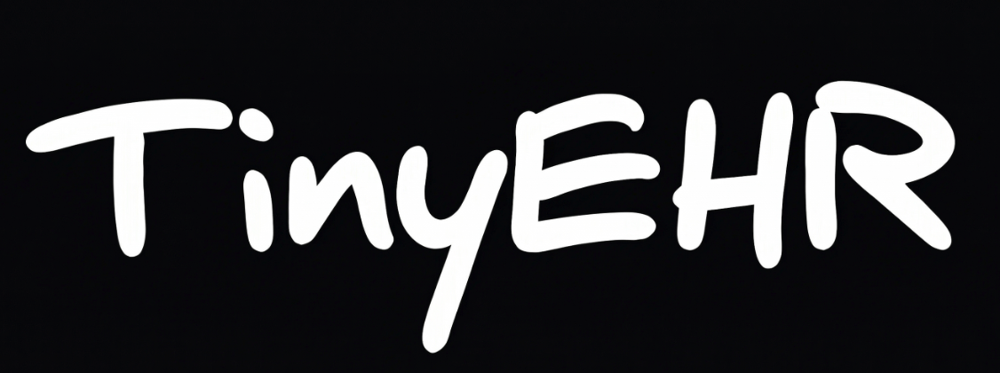
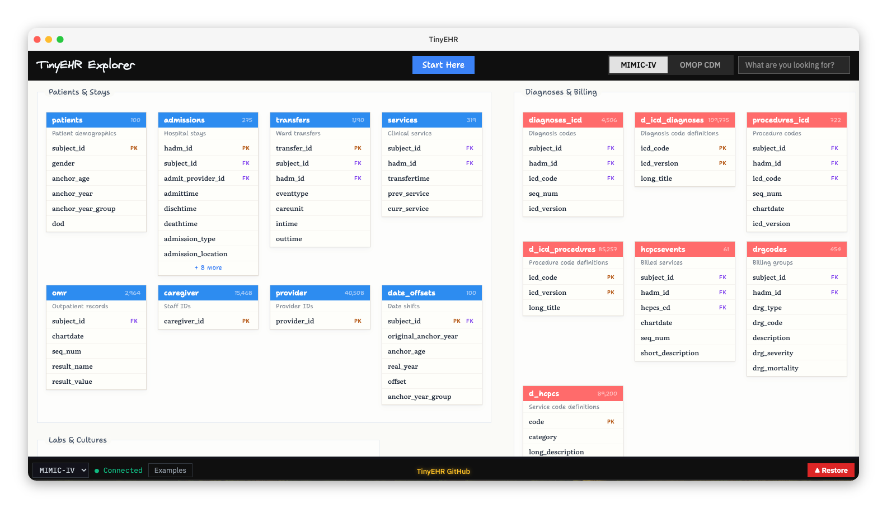
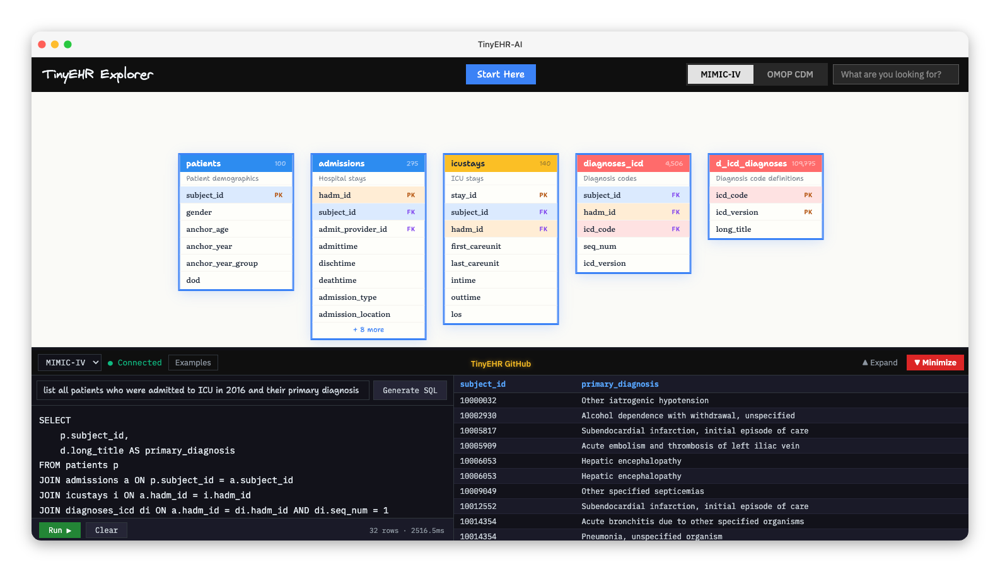

<p align="center">
  <a href="https://pypi.org/project/tinyehr/"></a>
  <a href="https://huggingface.co/datasets/vidulpanickan/TinyEHR"></a>
  
  <a href="https://tinyehr.org"></a>
</p>

A `100` patient dataset of Electronic Health Records, built for learning, experimenting, and prototyping healthcare data tools and AI agentic systems. Typically, working with real healthcare data requires credentialing and data access agreements. TinyEHR is free to use.

> [!CAUTION]
> This dataset is for learning, prototyping, and exploration only. It should not be used for clinical analysis, medical decision-making, or patient care.

<details>
<summary><b>New to EHR data? Here's what you need to know</b></summary>

Electronic Health Records are digital records of everything that happens during a patient's visit to the hospital. It includes information about the patients themselves, what they were diagnosed with, what tests and treatments they received, and what the doctors and nurses wrote down. Hospitals use them to track patient care, keep legal records, and handle billing. Each of these becomes a separate table in the database.

This dataset is derived from real EHR data from Beth Israel Deaconess Medical Center (BIDMC) in Boston, US. The data has been de-identified, meaning it has been stripped of any information that could identify the patient such as names, medical record numbers, and addresses to protect patient privacy.

</details>

<details>
<summary><b>What does the data look like?</b></summary>

**patients** (100 rows):

| subject_id | gender | anchor_age | anchor_year | anchor_year_group | dod |
|:-----------|:------:|-----------:|------------:|:------------------|:----|
| 10014729 | F | 21 | 2013 | 2011 - 2013 | |
| 10003400 | F | 72 | 2011 | 2011 - 2013 | 2014-09-02 |
| 10002428 | F | 80 | 2011 | 2011 - 2013 | |

**noteevents** (4,580 clinical notes):

| note_id | subject_id | note_type | chartdate | text |
|:--------|:-----------|:----------|:----------|:-----|
| 10000032-DS-0001 | 10000032 | Discharge summary | 2016-05-06 | Admission Date: 2016-05-06 Discharge Date: 2016-05-07 DOB: 1964 Sex: F... |
| 10000032-EC-0001 | 10000032 | ECG | 2016-05-06 | ECG Report NSR @ 80 bpm. Axis nl. Intervals WNL. No acute ST-T changes... |

There are 30+ tables covering admissions, diagnoses, lab results, medications, procedures, vitals, clinical notes, and more. Use the [TinyEHR Explorer](https://tinyehr.org) to browse all tables and their columns.

</details>

## How to use?

<table>
<tr>
<td align="center" width="25%"><b>Load as a DataFrame</b><br><br><code>pip install tinyehr</code> and pull tables directly as DataFrames</td>
<td align="center" width="25%"><b>Download from HuggingFace</b><br><br>Grab Parquet files from <a href="https://huggingface.co/datasets/vidulpanickan/TinyEHR">the dataset page</a></td>
<td align="center" width="25%"><b>Build with agents</b><br><br>Give your AI agents a realistic EHR dataset to query, reason over, and build with</td>
<td align="center" width="25%"><b>Learn and explore</b><br><br>Generate SQL queries within the <a href="https://tinyehr.org">TinyEHR Explorer</a> to learn and explore EHR data</td>
</tr>
</table>

**Browse the dataset**: explore 30+ tables, column definitions, and relationships across MIMIC-IV and OMOP formats.

<a href="https://tinyehr.org"></a>

**AI assisted SQL**: ask your queries in plain English.

<a href="https://tinyehr.org"></a>

## Quick Start

```bash
pip install tinyehr
```

```python
import tinyehr

patients = tinyehr.load_table("patients")
patients.head()
```

| subject_id | gender | anchor_age | anchor_year | anchor_year_group | dod |
|:-----------|:------:|-----------:|------------:|:------------------|:----|
| 10014729 | F | 21 | 2013 | 2011 - 2013 | NaT |
| 10003400 | F | 72 | 2011 | 2011 - 2013 | 2014-09-02 |
| 10002428 | F | 80 | 2011 | 2011 - 2013 | NaT |
| 10032725 | F | 38 | 2013 | 2011 - 2013 | 2013-03-30 |
| 10027445 | F | 48 | 2012 | 2011 - 2013 | 2016-02-09 |

<details>
<summary><b>More examples</b></summary>

### Pull all data for one patient

```python
patient = tinyehr.get_patient(10000032)
```

| Table | Rows |
|:------|-----:|
| admissions | 4 |
| chartevents | 477 |
| diagnoses_icd | 39 |
| labevents | 623 |
| noteevents | 32 |
| prescriptions | 81 |

### What's in the dataset?

```python
tinyehr.info()
```

| Table | Rows |
|:------|-----:|
| admissions | 275 |
| caregiver | 15,468 |
| chartevents | 668,862 |
| d_hcpcs | 89,200 |
| d_icd_diagnoses | 109,775 |
| ... | ... |

> *33 tables, 1,403,180 rows (MIMIC-IV format)*

### Load directly from HuggingFace

```python
import pandas as pd

df = pd.read_parquet("hf://datasets/vidulpanickan/TinyEHR/tinyehr_mimic_format/patients.parquet")
```

### Build a local SQLite database

```python
db_path = tinyehr.build_sqlite()

import sqlite3
conn = sqlite3.connect(db_path)
conn.execute("SELECT * FROM admissions LIMIT 5").fetchall()
```

</details>

<details>
<summary><b>How was this data created?</b></summary>

Built from the [MIMIC-IV Clinical Database Demo v2.2](https://physionet.org/content/mimic-iv-demo/2.2/) and the [MIMIC-IV Demo Data in the OMOP Common Data Model v0.9](https://physionet.org/content/mimic-iv-demo-omop/0.9/). TinyEHR preserves the original data exactly, with three changes: dates shifted to realistic years, diagnosis and procedure codes formatted with decimal points, and clinical notes generated from patient profiles.

TinyEHR ships in two formats from the same 100 patients. Both contain the same clinical information, just organized differently.

**MIMIC-IV Format (33 tables):** Follows the MIMIC-IV schema, a widely used format for de-identified electronic health records. 22 hospital tables, 9 ICU tables, plus 4,580 clinical notes and date shift metadata. Diagnosis and procedure codes include decimal points (e.g., `413.9`, `39.61`) to match clinical practice.

**OMOP CDM v5.3.1 Format (23 populated tables):** A standardized research format used by the OHDSI community to run the same analysis across hospitals worldwide. Diagnoses, lab tests, and medications are mapped to standardized medical vocabularies. Diagnosis codes are stored *without* decimal points (e.g., `4139`) because that's how they appear in billing and insurance claims.

Medical codes are stored as text strings to preserve leading zeros and formatting. Patient and visit IDs remain as numbers.

Full details: [ABOUT_THE_DATA.md](ABOUT_THE_DATA.md)

</details>

## Documentation

| Resource | Description |
|----------|-------------|
| [About the Data](ABOUT_THE_DATA.md) | Transformations, design decisions, glossary, and references |
| [TinyEHR Explorer](https://tinyehr.org) | Browse schemas, run SQL queries, AI assisted query generation |
| [HuggingFace](https://huggingface.co/datasets/vidulpanickan/TinyEHR) | Download Parquet files directly |
| [PyPI](https://pypi.org/project/tinyehr/) | `pip install tinyehr` |

## Known Limitations

- **100 patients only**: this is a learning and prototyping dataset, not statistically representative of any population
- **Clinical notes are generated and not validated**: the notes were generated using Anthropic's Claude Opus 4.6, grounded in each patient's structured data during their hospital visit. They have not been validated by clinicians and may contain hallucinated or inaccurate clinical details (e.g., incorrect ages, fabricated findings, inconsistent timelines). They should not be treated as clinically accurate
- **Single institution**: all data comes from one US academic medical center (Beth Israel Deaconess Medical Center in Boston)
- **OMOP vocabulary subset**: the OMOP format uses a subset of the full OHDSI Athena vocabulary, limited to the concepts needed for these 100 patients

## Roadmap

- Synthetic clinical notes authored by clinicians (currently generated by LLM)
- Additional data modalities including medical imaging (X-ray, CT scan)

## License

TinyEHR is openly available. No credentialing, data use agreements, or access requests required.

[ODbL-1.0](LICENSE) (Open Data Commons Open Database License). Free to use, share, and modify. Redistributed versions must use the same license.

## Citation

If you use TinyEHR in your work, please cite:

```bibtex
@misc{tinyehr2026,
  title={TinyEHR: A 100 Patient Electronic Health Records Dataset for Learning and Prototyping Agentic AI},
  author={Vidul Ayakulangara Panickan},
  year={2026},
  url={https://github.com/vidulpanickan/TinyEHR}
}
```

<details>
<summary><b>What's New (v0.2.0)</b></summary>

- **ICD-9 procedure codes**: decimal point now correctly placed after 2nd digit (`3961` → `39.61`)
- **OMOP format**: diagnosis codes now stored without decimal points, matching the standard billing/claims convention
- **Data types**: medical codes stored as text strings (preserves leading zeros), large IDs stored with full precision
- **Clinical notes**: regenerated from patient profiles with correct admission dates
- **Full rebuild**: all data regenerated from raw sources with ground-up validation

</details>
